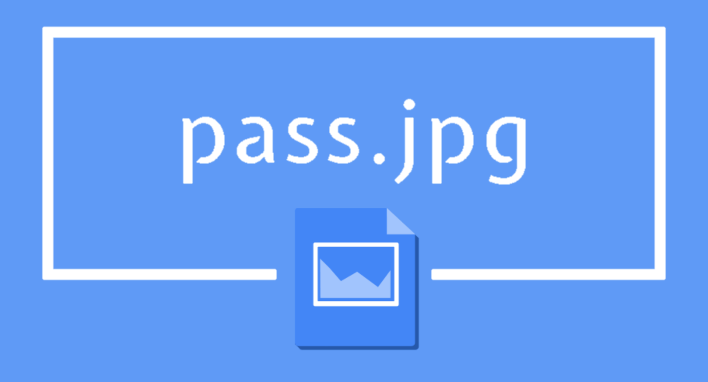

Welcome to pass.jpg! A revolutionary type of two factor authentication. Through creating a plug-in and a portfolio of images, we take advantage of the security RSA encryption has to offer, and have embedded the passwords of our users into the images via stenography. In the future, we hope to incorporate machine learning elements in order to detect phishing scams in the plug-in as well. 

We spent a lot of time debating if we were going to do this idea, as none of us had that much experience with Google Plug-Ins. However, we soon realized that our idea was unique and had potential to be something that we were all proud of if we were willing to put in the hours this day. We spent about an hour and a half getting familiar with Google Plug-ins, and from there, we subidivided the tasks up. The tutorial gave us a basic understanding of how to integrate it with websites, and using our prerequisite knowledge of javascript, html, and css, we were able to create a demo of our project in the short time we had. 
